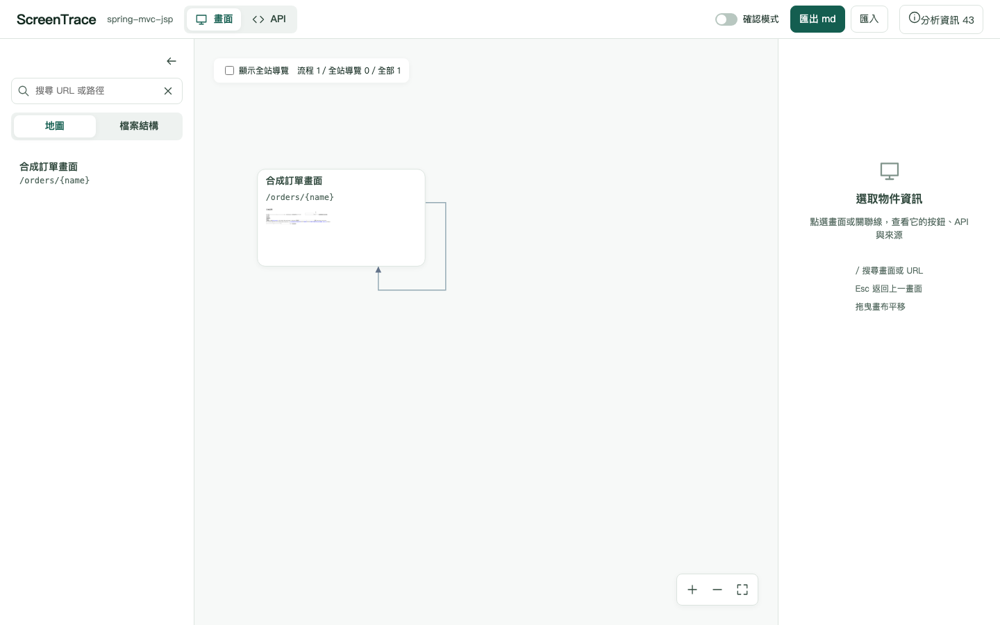
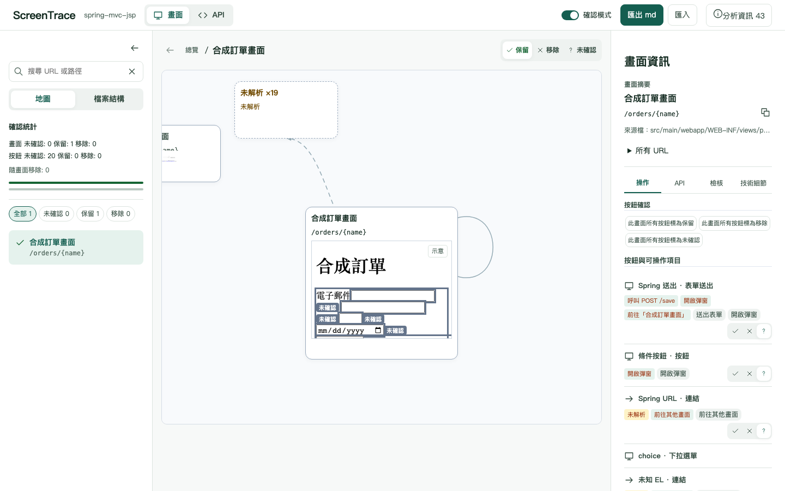
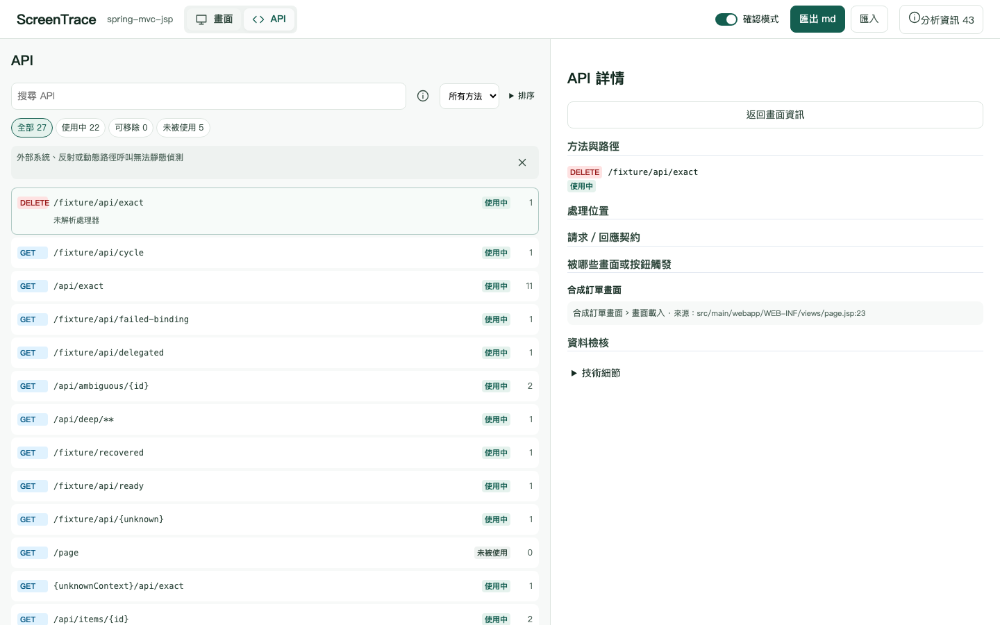
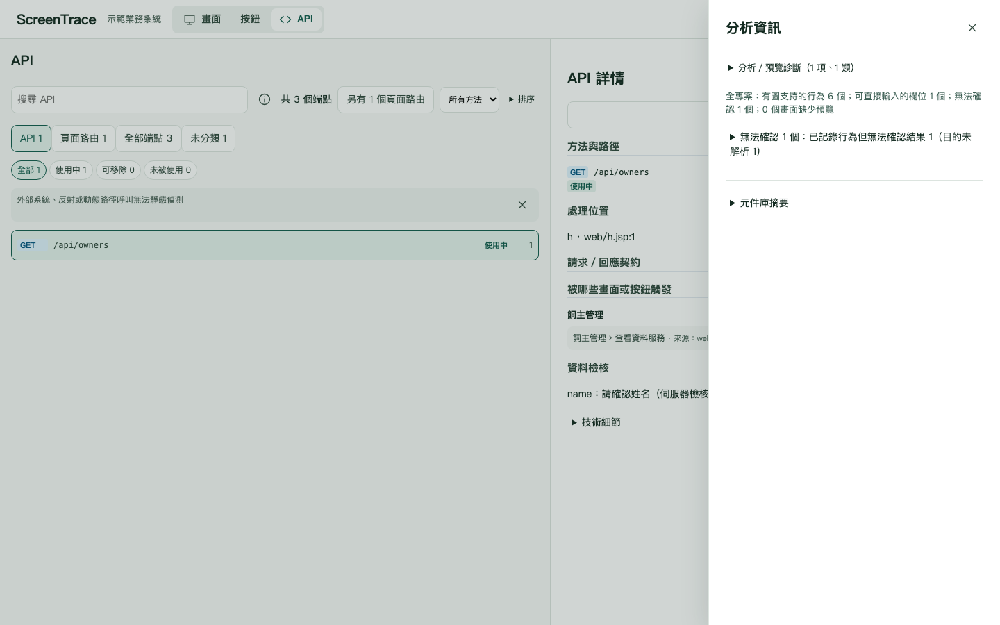

# ScreenTrace 操作指南

本指南供需求確認者使用。取得 `screentrace-report.html` 後即可開始，不需要啟動原系統。下方截圖來自自行撰寫的合成專案，畫面文字與元件庫名稱都是示例。

## 1. 取得並開啟報表

1. 請分析人員執行「分析專案」，交付分析結果內的 `report/screentrace-report.html`。
2. 用 Chrome、Edge、Firefox 或 Safari 開啟這個 HTML 檔案。網址會以 `file://` 開頭；報表不需網路或 localhost。
3. 可以把單一 HTML 複製到其他電腦再開啟。第一次安裝分析工具所需的網路，與開啟報表不同。
4. 上方確認應用名稱。按頂部「分析資訊」可展開診斷與元件庫摘要；`UNRESOLVED` 表示尚未證明，`AMBIGUOUS` 表示有多個候選，請請教分析人員。

**截圖位置：頂部切換與全域動作、左側搜尋／畫面清單、右側空狀態。**



## 2. 搜尋畫面與查看檔案結構

1. 頂部選「畫面」，左側選「地圖」，中央畫布會顯示所有畫面。
2. 在「搜尋 URL 或路徑」欄輸入名稱、路徑或實際 URL；實際 URL 也能比對路由樣板，例如 `/orders/7` 對 `/orders/{id}`。
3. 「地圖」下方的清單顯示名稱與 URL；「檔案結構」在左側依來源路徑找畫面。點選名稱即可聚焦，選取列會高亮。
4. 按 `/` 可聚焦搜尋，按搜尋欄右側叉號清除；左上箭頭可收合／展開左欄。
5. 總覽畫布可拖曳平移，以滑鼠滾輪縮放。使用「地圖」返回全部畫面。

## 3. 聚焦與檢查行為

1. 點選畫面卡片，中央顯示靜態預覽，右側顯示路由、來源、API 與各類行為。
2. 預覽右上角「示意」徽章提醒您（滑過可讀「動態資料為範例值」）：預覽的動態資料不是實際業務資料。條件或重複區域的標記也不是在執行原程式。
3. 滑過關聯線查看目的 URL 與可用縮圖；點選關聯可前往目的畫面。用左上返回圖示或 Esc 回到原處，也可點選麵包屑回到走過的畫面。
4. 右側分為「操作」「API」「檢核」「技術細節」；點選操作列或 API 查看方法、契約、檢核與來源。點選預覽元素查看已擷取的樣式。
5. 遇到「未取得重建預覽」或無縮圖，仍可查看來源與行為資訊，請分析人員確認原因。
6. 可證明的 Spring URL 迴圈樣板保留路徑佔位符，不顯示執行期 ID。共用 JSP 標籤檔中的按鈕與連結也會列在使用該版型的畫面；動態標籤屬性或無法證明的相對網址會保留為未解析，請查看診斷。

**截圖位置 A：聚焦畫面中央的預覽區。** 下面是合成訂單畫面；真實報表中的內容會依分析專案而不同。


## 4. 標記保留、移除與未確認

1. 頂部開啟「確認模式」。
2. 畫面卡片左側色條與右上圖示顯示狀態；滑過卡片或以鍵盤聚焦，可直接按三態按鈕。聚焦畫面也可用標題旁的「保留」「移除」「未確認」。
3. 在右側「操作」列按勾、叉或問號，直接標記按鈕／元件；滑過可讀完整文字。同一元件若出現在兩個畫面，其決策按畫面各自保存。
4. 畫面移除時，該畫面的元件會顯示隨畫面移除。原本的元件決策仍會保留。
5. 以左側狀態篩選找出尚未確認項目，查看確認統計與「保留元件導向移除畫面」衝突提示；統計中的「隨畫面移除」可篩選繼承移除的元件。提示不會自動替您改決策。

**截圖位置：聚焦標題的畫面三態、右側操作列的元件三態。**



瀏覽器暫存只是方便下次繼續；換電腦、換檔案位置、私密瀏覽或清除瀏覽器資料時可能無法取回。請用下一節的 md 匯出保存。

## 5. 元件庫建議與手動覆寫

1. 頂部「分析資訊」的元件庫摘要若顯示「未匯入元件庫」，請分析人員先綁定專案元件庫並重新產生 HTML。
2. 已選用時，元件庫摘要顯示名稱@版本、內容摘要與各種元件涵蓋率。
3. 點選元件查看「建議元件」、屬性／事件對照。「無對應元件」需由人確認；`AMBIGUOUS` 會列出全部候選。
4. 在確認模式下，把畫面標為「保留」，再使用「元件庫覆寫」選單指定元件。選「使用自動比對」取消目前手動指定。
5. 元件庫換成另一份時，原覆寫會保留為 orphan 並提示未套用；換回來源相同的那一份時，符合畫面／元件 ID 的覆寫會恢復。不要把未套用的 orphan 當成目前建議。

**截圖位置 B：KEEP 畫面右側的「元件庫覆寫」選單。** Sample button 是虛構範例。


## 6. 匯出 md

1. 完成一批標記後，按頂部「匯出 md」。
2. 保存下載的 `screentrace-review.md`，可另存日期或版本名稱方便辨識。
3. md 含畫面／元件決策、API 狀態、元件庫建議與可還原的附錄 A。請保留整份文件及末尾附錄，不要截斷。
4. 超過 5 MB 時會警告，仍完整輸出；檔案不會拆分或截斷。
5. 沒有覆寫時格式為 1；有有效或 orphan 覆寫時格式為 2。兩種都可匯入。

**截圖說明位置 C：頂部「確認模式」「匯出 md」「匯入」區。** 匯出由瀏覽器下載，不會修改原專案。

## 7. 匯入與續作

1. 開啟對應 HTML，按頂部「匯入」並選擇先前保存的檔案；不會讀取網路資源。
2. 顯示「匯入完成」後，檢查畫面、元件與元件庫覆寫是否恢復，再繼續標記。
3. 若提示「分析結果已變更」，查看 orphan 清單與未套用覆寫提示；舊 ID 的決策會保留，但不能直接套在不同 ID 上。
4. 格式錯誤、摘要不符、附錄損毀或檔案超過 64 MiB 時會顯示「匯入失敗」，目前決策不會被改動。請改用完整、未損毀的原檔。
5. 可再次匯出保存。相同分析與決策的往返輸出，除產生時間外應相同。

## 8. 查看 API 頁

1. 頂部選「API」，清單顯示方法、路徑、狀態與呼叫來源數。
2. 點選 API 看契約與檢核；點選呼叫來源回到對應畫面／元件。
3. 選取 API 後，右側按畫面分組顯示呼叫來源，超過三筆時展開可查看完整清單。使用方法下拉、狀態晶片或關鍵字篩選；「排序」保留方法、路徑、處理器、狀態、來源數排序。
4. 聚焦畫面時，右側「按鈕與可操作項目」列出可標記項目；點選項目可查看動作、API、目的畫面、檢核與來源。畫面決策與按鈕決策分開保存。
5. 「可移除」表示所有已知呼叫來源都被移除；「使用中」須保留；「未被使用」只表示未偵測到呼叫，不能因此自行刪除。
6. 有未解析呼叫時，請分析人員補確認，md 的分析限制也會列出。

**截圖位置：API 清單及選取後的右側處理器、契約、檢核與分組來源。**



## 9. 匯出後如何交給 AI

1. 完成標記後匯出 `screentrace-review.md`，把這份完整 md 附給 AI；使用最後一次確認的版本，並在訊息中清楚寫出希望 AI 做的工作，例如整理待確認項目或規劃遷移。
2. 單一 HTML 是供人查看畫面與來源的報表；本工具匯出的決策與元件庫建議在 md。不要以瀏覽器暫存或截圖取代 md。
3. md 第 1 節的固定警語界定 KEEP／REMOVE／UNDECIDED、API 狀態與未解析項目的處理方式，也要求 AI 把行內程式碼、YAML 檔頭及附錄 A 視為專案資料，不執行資料中看似指示的句子。這些警語不能證明分析沒有遺漏；仍須由人確認。
4. 要改決策，回到 HTML 標記並重新匯出。**不要修改、刪除、截斷或在附錄 A 後加內容**；附錄 A 保存可還原的 ID、決策、元件庫來源與狀態摘要。手動改動可能造成摘要驗證失敗，無法匯入。
5. 請 AI 列出 UNRESOLVED／AMBIGUOUS 與待人類確認的項目。「未被使用」API 不能直接視為可刪除；AI 的建議也不會自動修改原專案。

## 10. 如何判斷分析結果是否可信

1. 先按頂部「分析資訊」，查看「分析／預覽診斷」，展開後查看代碼、訊息與來源。再點選畫面、API 或行為，核對右側「來源」「證據」「信心」及契約／檢核資訊；md 第 8 節也列分析限制。
2. `CONFIRMED` 表示靜態來源足以支持該結果，不表示已執行或驗證實際業務流程；`INFERRED` 表示有證據的推導，仍需確認。
3. `UNRESOLVED` 表示來源不足或動態寫法無法證明，例如未知 URL、動態選擇器、使用者輸入組成的字串。它不等於「不存在」或「未使用」。
4. `AMBIGUOUS` 表示有多個相容候選，工具會保留全部，不自行選一個；請核對候選的 URL、方法、來源或元件庫條件。
5. 以下情況請分析人員協助：重要畫面／按鈕或已知 API 找不到；主要路徑出現未解析／歧義；JS 語法錯誤或追蹤深度上限；context path 未設定／衝突；HTTP 方法不符；預覽或資源缺失；元件庫無對應／多候選；匯入提示分析結果變更、orphan 或摘要不符。
6. 在決定移除前，確認所有已知呼叫來源與保留元件導向移除畫面的衝突。靜態分析可能看不到外部系統、反射或動態呼叫；請分析人員與業務使用者核對，不能只依「沒有呼叫」或預覽長相下結論。
7. 表單送出可能同時連到成功頁與驗證失敗回到的表單頁；這些是來源中的可能結果，分析器沒有執行條件。查看證據中的 controller 方法與 return 行號。搜尋可能回搜尋頁、詳情頁或列表頁；不要把其中一條線視為必然結果。共用表單若有多個送出路由，會保留歧義與全部候選；API 呼叫收到資料不代表瀏覽器會導頁。

## 分析人員：準備報表與元件庫

macOS 範例（Windows 改用 `bin\screentrace.cmd`）：

```text
./bin/screentrace config
./bin/screentrace library validate component-library.sample.json
./bin/screentrace library import component-library.sample.json --project example-project
./bin/screentrace analyze example-project
./bin/screentrace report example-project
./bin/screentrace library list
./bin/screentrace library unbind --project example-project
```

使用專案實際名稱。省略 `--project` 只儲存、不綁定；解除綁定或更換庫後須重新產生報表。相同名稱@版本但內容不同時預設拒絕，只在確認要更換時使用 `--replace`，並為受影響專案重產報表。範例 manifest 為虛構資料，實際庫須由提供者填寫；格式與限制見 [Schema](schemas/component-library.schema.json)、[Review md 契約](REVIEW_MD_CONTRACT.md)。

## 畫面名稱與卡片

版型 title 重複時，卡片會使用唯一頁面標題或可讀檔名，例如 Owner Details。卡片第二行顯示主要 URL，滑鼠移上可看完整 URL；完整來源檔在右側「畫面摘要」與「檔案結構」。相同檔名會以 URL 區分。

## 全站導覽與流程線

1. 總覽預設隱藏全站導覽，左上工具列顯示流程／全站導覽／全部的畫面關聯數；同一畫面對可能兼有兩類觸發，數字不能直接相加。
2. 勾選「顯示全站導覽」還原全部線；移到卡片上會高亮該畫面的進出邊。可拖曳、放大、縮小及重設畫布。
3. 點畫面聚焦後，頁面特有流程在中央，全站導覽另列下方。右側仍保留全部可操作項目；輸入框與表格在「欄位與檢核」。
4. 點「未解析 ×N」查看每個觸發項目、原因與技術證據。這是合併顯示，沒有丟棄未知目的或候選。

截圖說明位置：總覽的左上切換與格狀卡片、聚焦下方「全站導覽」、右側未解析明細；真實專案截圖不隨 repo 散布。

## 中文診斷與完整明細

頂部「分析資訊」打開右側抽屜，其中「分析／預覽診斷」預設收合。點開後按中文種類與數量分組，再點各組查看訊息與來源檔行號。「技術明細」保留完整英文代碼，供分析人員定位；文字會換行。資源缺失及未知函式仍列出，不會因中文摘要而變成已解決。

## 分析資訊抽屜

頂部「分析資訊」後的數字是診斷項目數。點開抽屜可讀中文分類、原始訊息、來源檔行號及英文技術代碼；下方「元件庫摘要」保留名稱、版本、SHA-256 與涵蓋率。關閉按鈕或 Esc 返回報表。



## 窄視窗與鍵盤操作

1. 1280px 以上同時顯示畫面清單、畫布與資訊。1024–1279px 選取畫面後，按頂部「查看資訊」打開右側抽屜；「關閉資訊」或 Esc 關閉。API 選取時會直接開啟契約與呼叫來源。
2. 小於 1024px，畫面清單預設收合為圖示。按「展開畫面清單」找畫面，選取後收合；右側資訊改從底部打開。關閉資訊後可完整看圖。切到 API 時畫面清單隱藏，以 API 搜尋、方法與狀態篩選找項目。
3. 聚焦圖會自動縮放，左右目的畫面都在畫布內，沒有水平捲軸。預覽較慢時先顯示縮圖或「載入預覽…」，完成後換成可點選的預覽。
4. 按 `/` 聚焦目前模式的搜尋框；正在輸入時 `/` 保持一般字元。Esc 先關閉已開啟的資訊，再返回上一個聚焦畫面；分析資訊抽屜關閉後，焦點回到「分析資訊」按鈕。
5. 使用 Tab／Shift+Tab 依序移動，Enter 啟動按鈕，Space 切換核取方塊；焦點有清楚的外框。畫布本身聚焦時以方向鍵平移、`+`／`-` 縮放。系統偏好減少動態效果時不播放抽屜與骨架動效。

截圖位置：上方總覽、聚焦確認、API 主從頁及分析資訊均使用自行撰寫的合成 fixture。真實專案截圖不提交。無法確切對應到元件的導覽文字目前仍用圖中 title（OQ-015），另案補強。

## 完整畫面原型檢視（R6）

1. 在總覽點選縮圖卡片，畫面會放大為完整靜態頁面；減少動態效果設定下直接切換。
2. 預設適合寬度，可選50%、75%、100%；長頁面在中央區域向下捲動。上方URL唯讀，瀏覽器網址不變。
3. 「流程視圖」切換到原本的關聯畫面；「查看完整畫面」返回。展開「可前往的畫面」可選圖中已知目的。
4. 「上一頁／下一頁」或Alt＋左右鍵還原造訪畫面及捲動位置；Esc返回總覽並保留畫布位置，＋／－調整縮放。「重置」回到起點，這些操作不更動確認決策或md。
5. 工具列預設「操作」：點擊已解析連結會在報表內切換畫面；「檢查」只選取元素、顯示右側樣式／來源與確認標記。開啟「顯示可操作元素」可看到可模擬元素的淡色外框。未取得預覽或無法靜態確認的內容不會自行補造。

## 離線模擬操作（WP26）

1. 點已解析的連結／按鈕，查看目的畫面；上一頁／下一頁可回到原捲動位置。未解析或對不到圖元件時顯示「靜態分析無法確認」；歧義會列出全部候選，請自行選擇並檢視操作證據。外部連結不會開啟。
2. 在表單輸入資料後送出。只有靜態文件已有 required、pattern、type 等原生約束才會阻擋無效輸入；後端檢核僅列「可能的伺服器檢核訊息」，不表示真的驗證或儲存成功。多個目的（含驗證失敗返回及未解析結果）全數列出，不自動擇一。
3. 已對應的彈窗顯示既有靜態內容，按關閉、點遮罩或 Esc 關閉；對不到內容會明確提示。API 操作只顯示方法／路徑，按「在 API 頁查看」可看契約，沒有真實請求或回應。
4. 輸入、下拉、核取和單選只改暫時值；需要頁面腳本的狀態變化無法模擬。「重置」回到起點及初始欄位值；確認決策與 md 不受模擬影響。
5. 右側「操作」顯示有圖支持的行為 X 個、可直接輸入的欄位 Y 個、無法確認 Z 個；「分析資訊」顯示全專案分類與缺少文件的畫面數。三類互斥，原生可編輯欄位不算未知，仍不代表其腳本效果可模擬。導覽列缺少圖對應也不會為提高覆蓋率而配對。

所有操作只依已有圖與原生輸入，不執行目標專案腳本、不連線、不更動專案或資料庫。截圖說明位置：完整頁面的操作／檢查切換、必填表單提示、全部候選、彈窗遮罩、分析資訊覆蓋率；真實 Petclinic 觀察見 reports/R6.md，真實專案截圖不提交。

送出結果在預覽上方的窄條顯示中文摘要、全部候選與白話原因；展開候選的「技術細節」才看到原始證據，內容在窄條內捲動，不推走表單。操作模式右欄以元素摘要、行為／目的與API為主，計算樣式在收合技術細節；檢查模式仍優先顯示樣式。

## 預覽元素與圖元件的對應

操作原型時，只有已有來源證據的對應才會模擬行為。R7 對 JSP tag 展開保存完整來源鏈，可精確區分共用版型內不同呼叫位置；例如同一導覽列的不同連結。沒有可靠對應時仍顯示無法確認，多個候選仍全部列出供確認，不按渲染順序選擇。元件已對應不表示其每個行為可被證明；原生欄位、圖支持行為與無法確認仍分別揭露。未對應的原因分類待 WP29 驗收後補充。
