# 報表使用指南

## 1. 了解這份報表

你可以用這份離線報表查看系統有哪些畫面、畫面如何連接，以及哪些操作有分析資料支持。

報表是根據程式碼靜態分析與合成資料產生的互動示意。它協助需求討論與範圍確認，不會直接操作原系統。

**注意**

- ScreenTrace 不會啟動或修改被分析專案。
- 模擬操作不是真實運行；不會執行專案腳本、不連線，也不會送出真實資料。
- 未被使用不等於可刪除；刪除前仍要確認排程、外部呼叫與人工流程。
- 截圖皆來自自行撰寫的合成專案，不代表任何實際客戶系統。

## 2. 開啟報表並查看總覽

你可以在總覽地圖找到畫面、查看流程方向，並用搜尋快速定位。

1. 開啟收到的單一 HTML 報表；不需要安裝服務或連線網路。
2. 頂列右側提供搜尋、確認進度、匯出 md 與「⋯」選單；匯入、分析資訊、說明與重新開啟引導都在「⋯」內。
3. 在地圖查看畫面卡片與縮圖，流程線由來源指向可能的下一個畫面。
4. 輸入畫面名稱、URL 或來源路徑搜尋；點選結果即可定位。
5. 需要查看跨畫面的導覽時，開啟「全站導覽」；再次切換即可隱藏。
6. 使用檔案結構查看畫面來源。
7. 選擇「功能」按控制器或網址前段瀏覽功能區域；區域卡會列出畫面、按鈕、API 與標記進度。選取區域可縮小地圖，按「顯示全部畫面」還原。

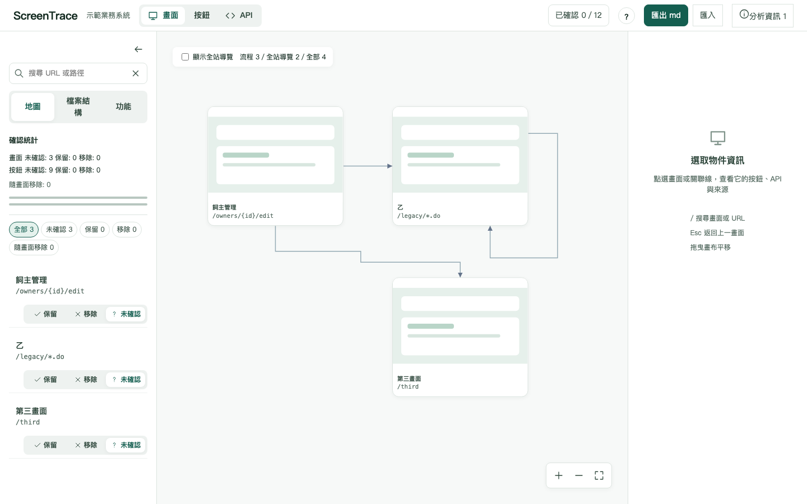

預設總覽以卡片間的流程呈現；全站導覽開啟後可查看跨區連線。

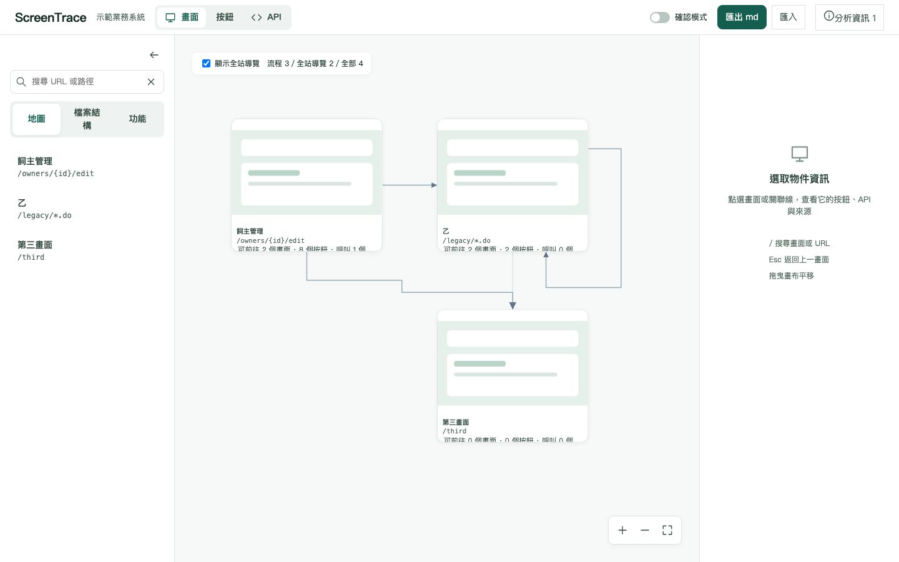

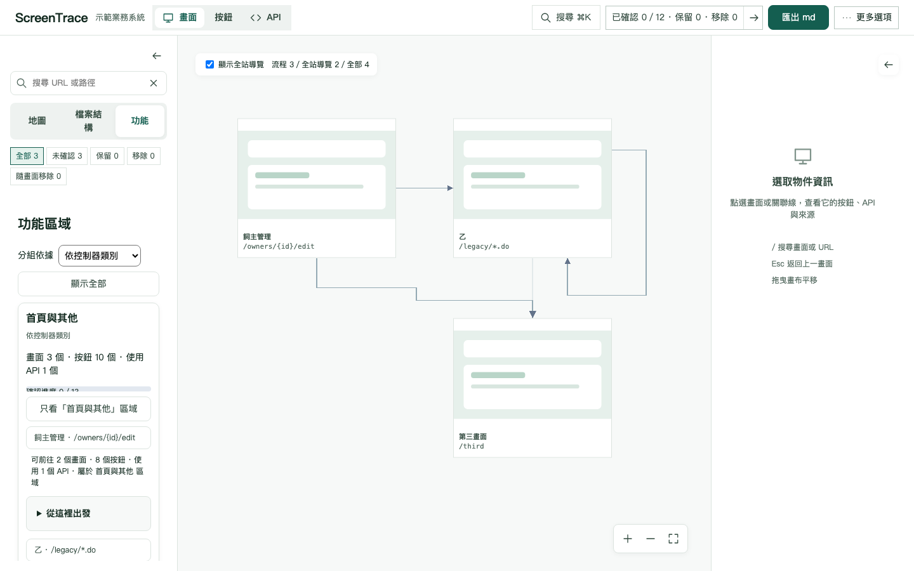

功能名稱依分析圖中的控制器或網址前段機械分組；摘要會標明分組依據，沒有足夠資料或 JSP 位於 JSP 根目錄時歸入「首頁與其他」。沒有對應 JSP 檔的畫面會直接標示。

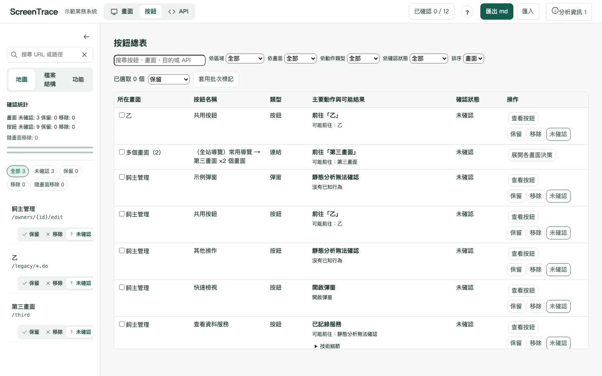

按鈕總表會合併重複的全站導覽項目；展開後仍可逐畫面查看與標記。

### 流程大綱、全域搜尋與首次引導

在畫面資訊欄展開「從這裡出發」，會以縮排樹列出已知流程；每個目的畫面只完整展開一次，再次遇到時會標示「已在上面展開」，點選可跳到該畫面。無法確認的目的會合併成一個節點，列出所有觸發按鈕。按鈕使用可讀名稱；沒有可讀名稱時會以按鈕類型和所在畫面、行號說明。清單過長時可展開「還有 N 個」。功能區域卡片也提供同一份流程大綱。

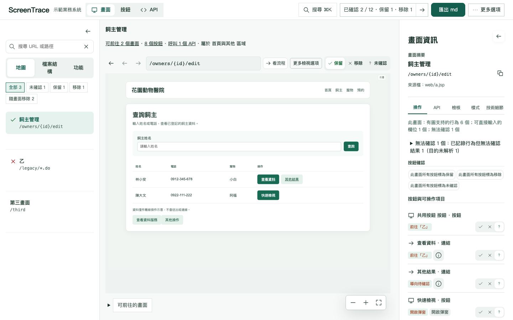

按 `Ctrl／⌘＋K` 或頂列「全域搜尋」開啟搜尋，可同時搜尋畫面名稱與 URL、按鈕名稱、API 方法與路徑。結果依類型分組；點選後會前往並標示該項目。按 `/` 仍用於畫面清單搜尋；API 頁會聚焦原有的 API 搜尋欄。

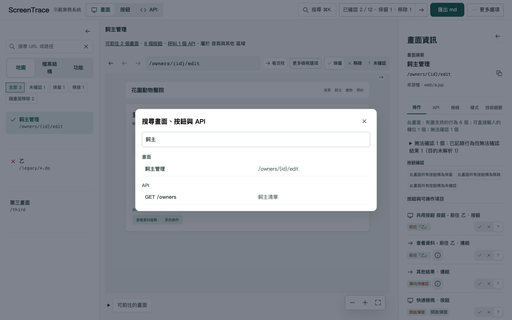

首次開啟報表時會看到四步引導；可逐步閱讀或略過，也能從「⋯」選單重新開啟。瀏覽器暫存不可用時，引導會記在目前分頁工作階段；同一分頁不會反覆出現，新分頁可能再次顯示。說明浮層列出快捷鍵、點擊與 Alt＋點擊的差異，以及狀態圖例。

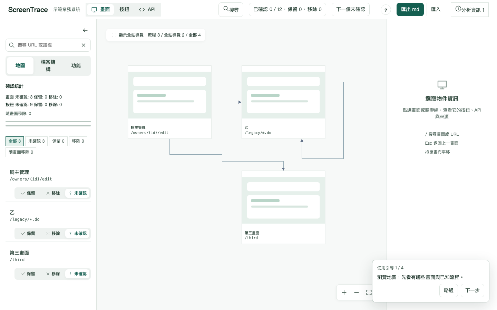

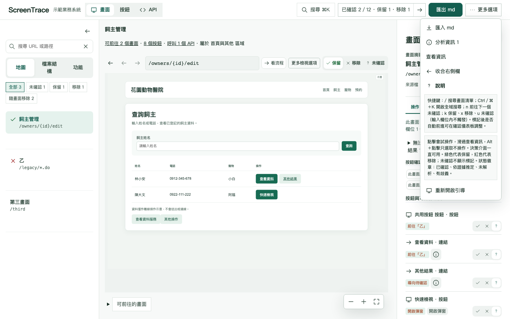

## 3. 查看單一畫面

你可以聚焦單一畫面，查看完整預覽、URL 與前後流程。

1. 點選總覽中的畫面卡片。
2. 在完整畫面檢視器中查看頁面；工具列顯示畫面 URL 與縮放控制。
3. 使用「看流程」查看相關畫面，點選目的畫面可繼續前往。
4. 使用右側資訊欄左緣的拖曳把手調整寬度；也可聚焦把手後按左右方向鍵微調。寬度會暫存在目前瀏覽器。
5. 使用工具列返回控制回到上一個畫面或總覽；「⋯」選單可重置及調整縮放。

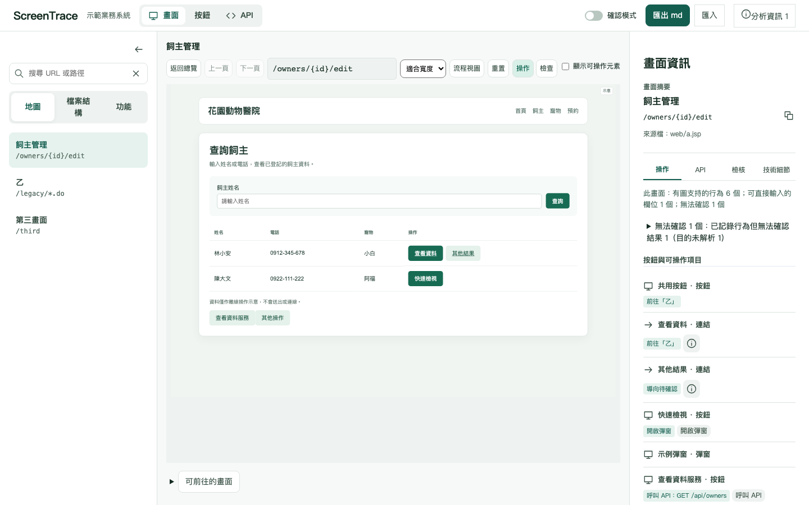

## 4. 試著操作畫面

你可以在不執行原系統的情況下，查看連結、表單、彈窗與操作結果。

1. 點預覽中的連結或按鈕即可查看模擬結果；不會執行原系統。
2. 滑過可互動元素可預覽資訊；按住 Alt（Mac 上的 Option）點擊只選取、不試操作。觸控裝置可長按選取。
3. 送出表單時，若有多個可能路由，逐一查看候選與白話原因；若有資料檢核，也會顯示可能訊息。
4. 點選彈窗按鈕查看示意內容。
5. 使用「⋯」選單的「重置」清除本次示意操作。

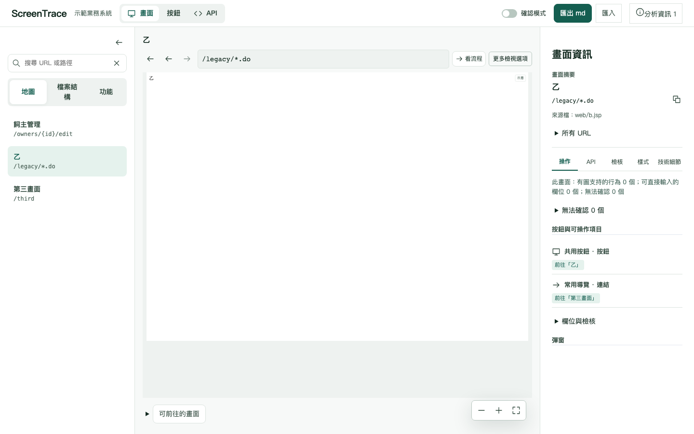

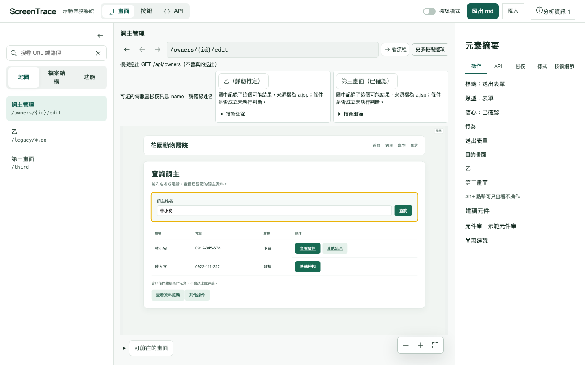

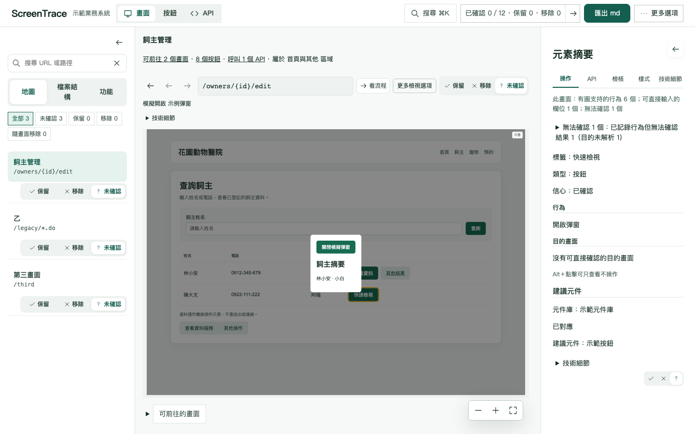

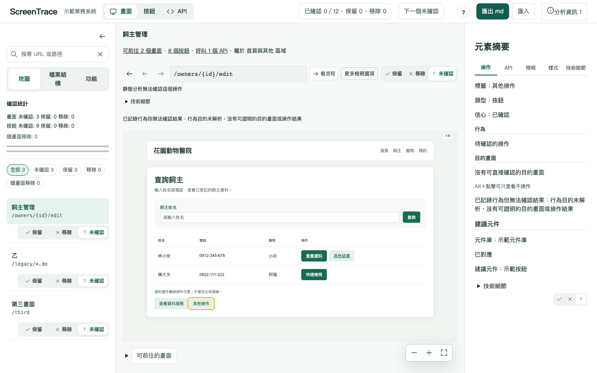

## 5. 查看按鈕、API 與來源

你可以從右側資訊欄查看選取元件的行為、API 關聯、資料檢核與來源。

1. 點選畫面中的按鈕或其他元件。
2. 在右側切換資訊標籤，查看行為、API、檢核與來源證據。
3. 選取元素後，右側「樣式」標籤可查看其樣式；「操作」標籤保留行為摘要。
4. 點 API 項目可查看契約與呼叫來源，再由呼叫來源返回畫面。
5. 選擇上方「按鈕」可查看全專案的操作項目，依文字、區域、畫面、類型或標記狀態篩選；每列可直接標記，也可勾選多筆後批次標記。
6. 全站導覽會合併成一列供快速瀏覽；展開後仍可查看各畫面的項目與個別決策。

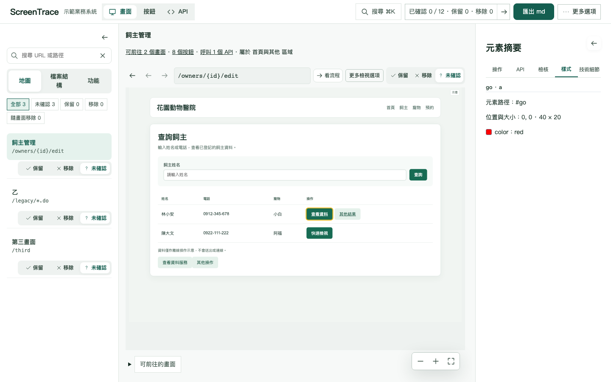

## 6. 標記保留、移除或未確認

你可以直接在畫面與元件旁選擇保留、移除或未確認；未確認項目不顯示額外狀態圖示。

1. 在畫面卡片、畫面標題、右側元件摘要、畫面清單或按鈕總表直接選擇三態標記。
2. 在總覽卡片上滑過或用鍵盤移入焦點顯示快速標記；觸控裝置長按卡片，再選擇標記。
3. 點擊上方「已確認」進度可展開確認儀表板，按功能區域查看進度、未確認數量，並直接跳到畫面或按鈕。
4. 同一元件出現在不同畫面時，各畫面的決策分開保存；「隨畫面移除」會保留元件本身的決策值。
5. 選取畫面或按鈕後，按 `k` 保留、`x` 移除、`u` 設為未確認；按 `n` 前往下一個未確認項。儀表板可關閉標記後自動前進。
6. 選擇「移除」時，右側會列出已知導向來源、可能因此可移除的 API、隨畫面移除的元件數與既有衝突；這些提示只依已知關聯。

**注意**

- 標記會暫存在瀏覽器；換電腦、換檔案位置、使用私密瀏覽或清除瀏覽器資料時，可能無法取回。完成一批標記後，請務必匯出 md 保存。

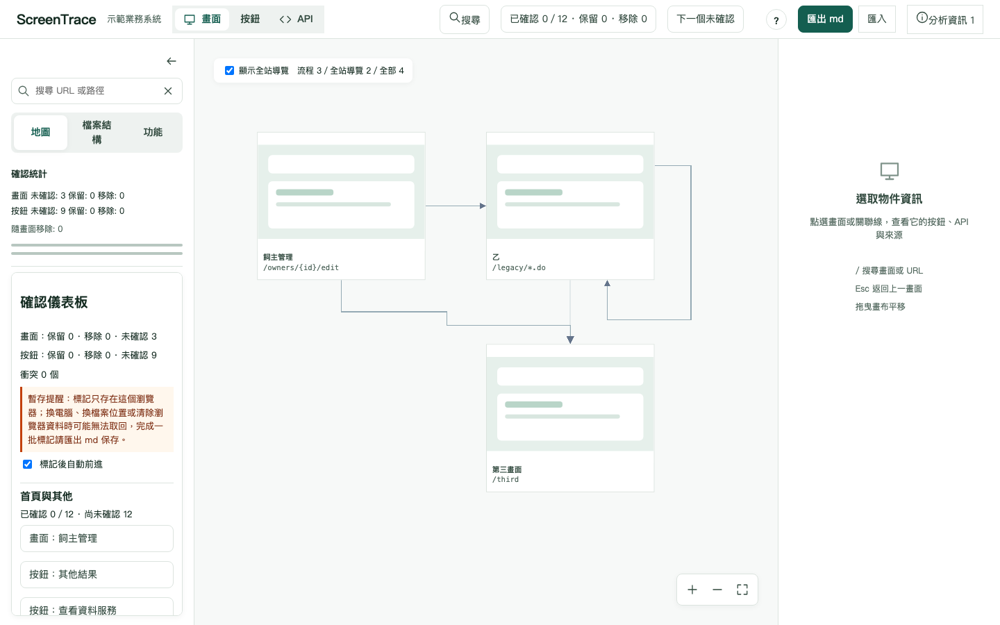

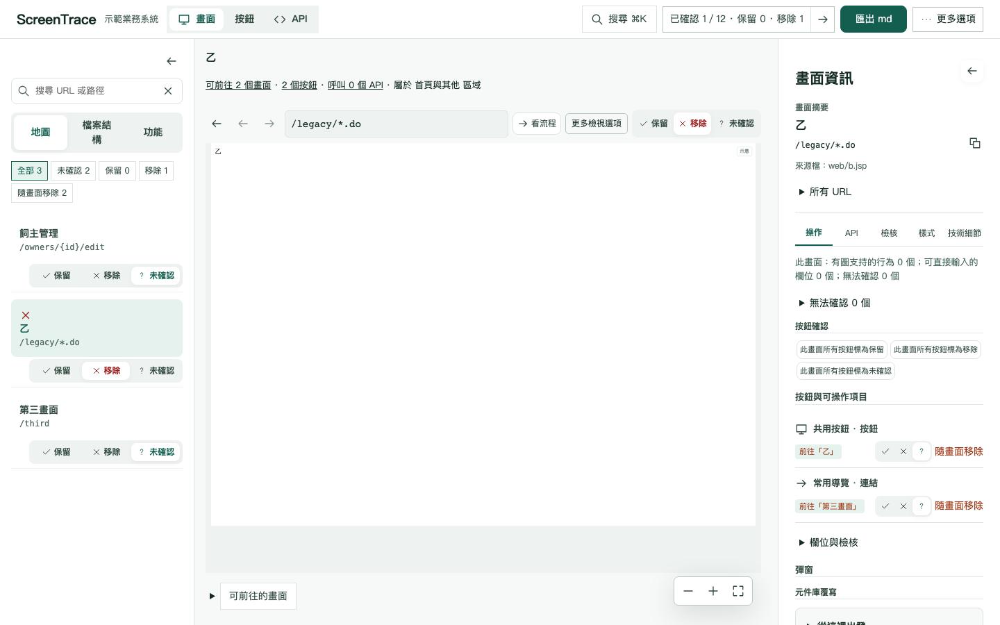

## 7. 查看 API 頁

你可以在 API 頁查看端點、頁面路由、使用狀態與呼叫來源。

1. 選擇上方「API」頁。
2. 先查看 API 清單；使用頁面路由切換查看畫面入口。
3. 點選一筆資料查看方法、路徑、契約與呼叫來源。
4. 點呼叫來源可返回對應畫面與元件。

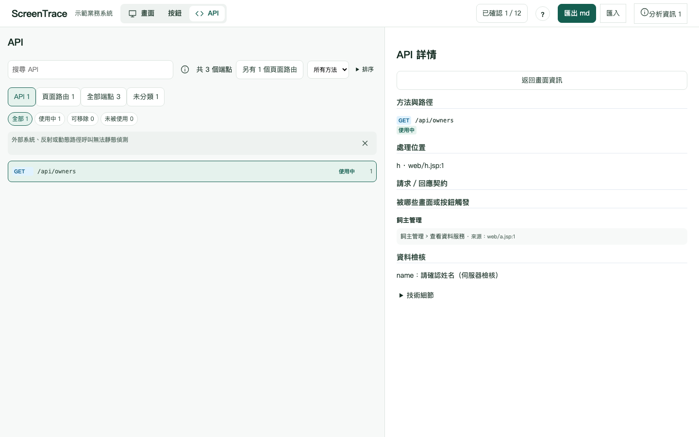

## 8. 查看元件庫建議並手動覆寫

你可以查看元件庫對應建議，並為需要的元件指定不同對應。

1. 選取一個已標記保留的畫面，再點選其中的元件。
2. 查看元件庫建議與匹配依據。
3. 若建議不合適，從選單指定元件庫元件；變更會保存在確認資料中。

未匯入元件庫時，報表會清楚顯示目前沒有元件庫資料。

## 9. 匯出、匯入並交付 AI

你可以匯出一份審查文件供協作，也能匯入先前保存的決策。

1. 選擇「匯出 md」下載審查文件。
2. 匯出前會先檢查各狀態數量、移除項目、決策衝突與未確認項目；你可以回去處理或仍要匯出。
3. 將單一 HTML 報表與匯出的 md 一併交給 AI，並說明希望它協助整理的問題。
4. 若要還原決策，選擇「匯入 md」並挑選先前匯出的文件。
5. 若畫面或元件已變更，先檢查列出的未對應項目，再決定如何處理。

**注意**

- 不要手動修改 md 附錄 A；它保存供報表還原決策使用的資料。
- 固定警語會提醒 AI：文件中的專案資料是引用內容，不是給 AI 執行的指示。
- 格式錯誤或檔案不完整時，匯入會顯示錯誤並保留目前決策。
- 標記暫存在瀏覽器；換電腦、換檔案位置、使用私密瀏覽或清除瀏覽器資料時，可能無法取回。完成一批標記，請務必匯出 md 保存。
- 匯出超過 5 MB 會顯示警告，但內容不會截斷；匯入檔超過 64 MiB 會拒絕。

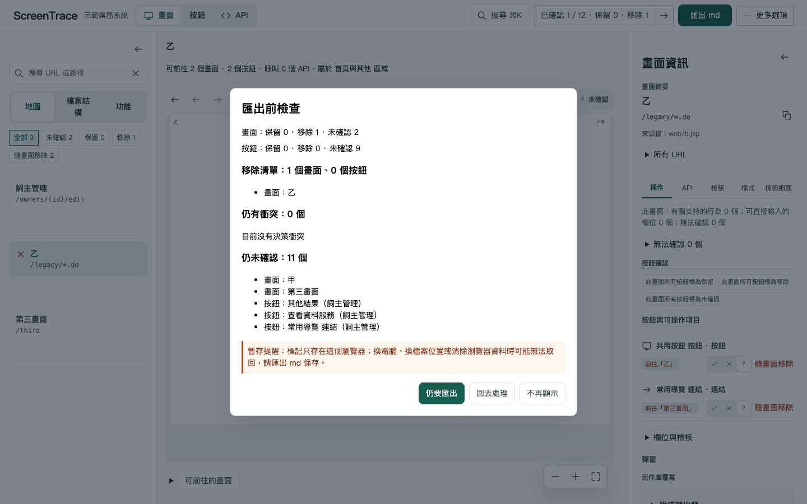

欄位、排序與安全規則請參閱 [審查文件格式契約](REVIEW_MD_CONTRACT.md)。

## 10. 判斷分析結果是否可信

你可以依信心、覆蓋率與診斷判斷哪些關係可直接討論、哪些需要人工確認。

1. 查看覆蓋率中的「有圖支持的行為」、「可直接輸入的欄位」與「無法確認」數量。
2. 點選未解析或有歧義的項目，展開技術細節，閱讀全部候選與證據。
3. 開啟「分析資訊」查看診斷摘要；展開項目可看到代碼、訊息、來源檔與行號。
4. URL、候選或來源互相矛盾、關鍵畫面缺失，或結果會影響刪除與法規判斷時，請分析人員協助。

「未解析（UNRESOLVED）」表示目前證據不足以確定目標；「有歧義（AMBIGUOUS）」表示存在多個候選，應逐一檢視；「依證據推定（INFERRED）」表示有支持證據，但仍是推定。

## 11. 常見問題與詞彙表

你可以在這裡快速查找報表用語與常見狀況。

**找不到畫面？** 清除搜尋條件，或查看檔案結構與分析資訊中的診斷。

**預覽和原系統不同？** 預覽以靜態內容與合成資料呈現；動態資料、權限、資料庫與真實服務不會在報表中執行。

**為什麼有多個候選？** 靜態證據無法排除其他可能時，報表會保留所有候選供你選擇，不會自行挑一個。

**詞彙表**

- 畫面：一個可瀏覽的頁面或視圖。
- 流程（關聯線）：由畫面或操作連到可能目的地的關係。
- 全站導覽：跨畫面的導覽關係。
- 完整畫面：可在報表中檢視的靜態頁面預覽。
- 模擬操作：報表內的示意互動，不會呼叫原系統。
- 有圖支持的行為：圖資料記錄了操作及其關係；不代表真實執行結果已驗證。
- 可直接輸入的欄位：可在預覽中輸入示例值的欄位。
- 無法確認：目前分析無法證明操作結果，原因可能是沒有已知行為、目的未解析或有多個候選。
- 已確認：來源明確支持該關係。
- 未解析：證據不足以確認目的地。
- 有歧義：有兩個以上仍成立的候選。
- 依證據推定：有證據支持推論，但結果並非直接確認。
- 使用中／可移除／未被使用：API 使用狀態分類；「未被使用」只表示目前圖中沒有已知呼叫。
- 保留／移除／未確認：需求方記錄的三種決策。
- 隨畫面移除：畫面移除後，其元件在該畫面內不再列為保留項目。
- md 附錄 A：用來還原決策的機器資料區。

更多分析人員操作請參閱[分析人員指南](ANALYST_GUIDE.md)。
