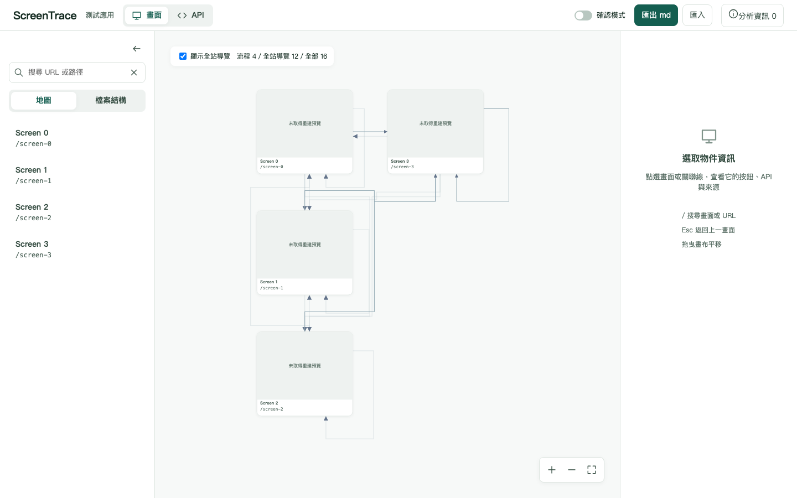

# R10：使用者體驗調整紀錄

日期：2026-10-05。本次只完成 WP34；依停止點等待需求方確認。WP35–WP38 尚未開始。

## WP34：全站導覽分組回歸

R7 tag 展開為每次元件加入不同 `expansionAnchor`，舊版 `navigationKey()` 把全部屬性序列化進鍵，令同一組導覽無法跨畫面合併。現在按固定順序只比較目標畫面、可見名稱及 `kind`、`tag`、`componentType`、`href`、`target`、`httpMethod`。錨點、元件 ID 與來源資訊不會改變導覽項目身份。畫面特有連結仍各自保留為流程。

先在 commit `bb9cd1e` 提交四畫面合成測試。它在舊實作上實際失敗：預期 12 個全站導覽關聯，舊版分類為 0；修正後通過。R5「同目的地仍保留畫面特有流程」測試及其斷言未修改。沒有改分析器、graph schema、API 推導、md 或決策格式。

viewer 屬性比較盤點：`overview.ts` 的整份 `attributes` 進入全站導覽鍵是本次受影響處，已改為白名單。`contracts.ts` 的 JSON 比較只驗證預覽錨點候選陣列是否與圖中候選相符；`shared/library.ts` 只對 manifest 明列的屬性條件建立去重鍵。`preview.ts` 與 `inert-document.ts` 逐個檢查／轉換 DOM 屬性是安全清理，不是元件身份比較。其餘 `attributes` 用途均讀取明確欄位或展示技術資料，不會把來源錨點放入全站導覽身份鍵。

## PetClinic 實際分析與報表觀察

以 `analyze spring-framework-petclinic < /dev/null` 與 `report spring-framework-petclinic < /dev/null` 執行；命令使用暫存工作區設定，target 專案唯讀，未啟動專案程式。實際分析為 19 個 endpoint、10 個畫面、92 個元件。用 Chromium 以 `file://`、1440×900 開啟本次報表，瀏覽器沒有對外請求。工具列實際顯示「流程 14／全站導覽 36／全部 49」；預設畫出 14 條流程線，開啟全站導覽後顯示 49 條不同畫面關聯線。36 個全站導覽分類與 14 個流程分類有一組相同起訖畫面，因此分類數合計比 49 多 1；該混合關聯只畫一次，沒有重複線或遺失觸發元件。



截圖只來自自行撰寫的四畫面 fixture（每畫面三個帶不同展開錨點的全站項目，加一個畫面特有流程），不含 PetClinic 畫面或輸出。PetClinic 報表 HTML 實際大小 3,613,927 bytes；工作區修正前保存的單檔報表為 3,613,851 bytes，增加 76 bytes（約 0.002%），低於 8% 上限。此比較按兩個實際檔案大小計算；repo 沒有 R9 報表紀錄可獨立核對其生成版本。

執行命令（`<repo>` 與暫存工作區為執行環境代稱；輸入皆為非互動）：

```sh
java -Duser.home=<temporary-workspace> -Djava.awt.headless=true -Dscreentrace.js.module=<repo>/screentrace-js/cli.mjs -jar <repo>/screentrace-cli/target/screentrace-cli-0.1.0-SNAPSHOT.jar analyze spring-framework-petclinic < /dev/null
java -Duser.home=<temporary-workspace> -Djava.awt.headless=true -Dscreentrace.js.module=<repo>/screentrace-js/cli.mjs -jar <repo>/screentrace-cli/target/screentrace-cli-0.1.0-SNAPSHOT.jar report spring-framework-petclinic < /dev/null
```

## 驗證

- `mvn clean verify`：270 Java 測試通過，0 失敗、錯誤或略過。
- `npm --prefix screentrace-js test`：40 通過。
- `npm --prefix screentrace-viewer run build`：通過；`npm --prefix screentrace-viewer test`：84 通過。
- 指定的 capture 測試：33 通過。
- `npm --prefix screentrace-viewer run e2e`：86 通過。
- 新合成截圖產生成功；PetClinic file URL 離線檢查為 0 對外請求。

## 需求方角度自我審閱與停止點

只靠本輪報表，使用者能分辨整體畫面流程數和全站導覽數，且全站導覽重新分組。仍不能在十分鐘內完整回答「系統有哪些功能、如何從 A 功能走到 B、哪些按鈕還沒確認」：功能區域模式與按鈕總表尚屬 WP35／WP36，確認進度儀表板及下一個未確認尚屬 WP37，流程文字大綱與全域搜尋尚屬 WP38。本輪依 WP34 停止，未提前實作。

ADR：[0057 全站導覽語意身份](../adr/0057-global-navigation-semantic-identity.md)。提交順序為失敗測試 `bb9cd1e`、修正與合成截圖 `9e3c53c`；本報告與路線圖為後續文件提交。未推送；遠端 CI 未執行。
